<div align="center">


<br/>

<a href="https://giraysengonul.com/">
  
</a>

<br/><br/>

<p>
  
  
  
  
</p>

<a href="https://www.linkedin.com/in/giray-sengonul-168420318/">
  
</a>
<a href="https://giraysengonul.cv/">
  
</a>
<a href="mailto:giraysengonul@gmail.com">
  
</a>
<a href="https://github.com/giraysengonul">
  
</a>

</div>

<br/>


##  About Me

<table>
<tr>
<td width="58%" valign="top">

```python
class GiraySengonul:
    def __init__(self):
        self.name      = "Giray Şengönül"
        self.role      = ["Data Analyst", "Data Scientist"]
        self.location  = "Türkiye 🇹🇷"
        self.languages = ["Python", "SQL", "DAX", "Swift"]
        self.mindset   = "Data-driven, detail-obsessed, business-aware"

    def current_focus(self):
        return [
            "📊 Building end-to-end analytics pipelines",
            "🧠 Designing predictive ML models",
            "📈 Crafting executive-level dashboards",
            "🔬 Exploring deep learning & NLP",
            "🚀 Bridging analytics with data science",
        ]

    def expertise(self):
        return {
            "analytics":     ["EDA", "A/B Testing", "Statistical Inference"],
            "ml":            ["Regression", "Classification", "Clustering"],
            "deep_learning": ["TensorFlow", "PyTorch", "Neural Networks"],
            "bi":            ["Power BI", "Tableau", "Excel Modeling"],
            "engineering":   ["ETL Pipelines", "SQL Optimization", "AWS/Azure"],
        }

    def philosophy(self):
        return "Data tells stories — I build the bridge between numbers and decisions."
```

</td>
<td width="42%" valign="top">

<div align="center">

### 🎯 At a Glance

🔁 **Career:** Pivoted into Data  
📊 **Specialty:** Analytics + ML  
🧠 **Strength:** Insight Engineering  
🎓 **Goal:** Senior Data Scientist  
🌍 **Based:** Türkiye  
☕ **Fueled by:** Coffee & curiosity  

<br/>


</div>

</td>
</tr>
</table>

<br/>


##  Tech Arsenal

<div align="center">

### 🐍 Programming & Core Languages


<br/><br/>

### 📊 Data Analysis & Manipulation


<br/><br/>

### 🤖 Machine Learning & Deep Learning


<br/><br/>

### 📈 Visualization & BI


<br/><br/>

### ☁️ Cloud, Databases & Infrastructure


<br/><br/>

### 🛠️ Tools & DevOps

<p>
  
</p>

</div>

<br/>


##  Core Competencies

<div align="center">

| 🔍 **Data Analytics** | 🤖 **Data Science / ML** | 📊 **Business Intelligence** | ☁️ **Data Engineering** |
|:--|:--|:--|:--|
| Exploratory Data Analysis (EDA) | Supervised Learning | Power BI Dashboards | ETL Pipeline Design |
| Statistical Hypothesis Testing | Unsupervised Clustering | Tableau Storyboards | SQL Query Optimization |
| A/B Testing & Experimentation | Predictive Modeling | KPI Frameworks | Data Cleaning & Validation |
| Cohort & Funnel Analysis | Feature Engineering | Executive Reporting | Cloud Storage (AWS / Azure) |
| Time Series Analysis | Model Evaluation & Tuning | DAX Measures | Workflow Automation |
| Customer Segmentation | Deep Learning (CNN, RNN) | Power Query (M Lang.) | Pipeline Monitoring |

```mermaid
graph LR
    A[📥 Raw Data<br/>Sources] -->|Extract| B[🧹 Cleaning &<br/>Validation]
    B -->|Transform| C[🔍 Exploratory<br/>Analysis]
    C -->|Engineer| D[⚙️ Feature<br/>Engineering]
    D -->|Train| E[🤖 ML / DL<br/>Modeling]
    E -->|Evaluate| F[📊 Insights &<br/>Visualization]
    F -->|Deliver| G[💡 Strategic<br/>Decisions]
    G -->|Drive| H[🚀 Business<br/>Value]

    style A fill:#00d4ff,stroke:#000,color:#000,stroke-width:2px
    style B fill:#00b4d8,stroke:#000,color:#000,stroke-width:2px
    style C fill:#0096c7,stroke:#fff,color:#fff,stroke-width:2px
    style D fill:#0077b6,stroke:#fff,color:#fff,stroke-width:2px
    style E fill:#005f99,stroke:#fff,color:#fff,stroke-width:2px
    style F fill:#023e8a,stroke:#fff,color:#fff,stroke-width:2px
    style G fill:#03045e,stroke:#fff,color:#fff,stroke-width:2px
    style H fill:#000814,stroke:#00d4ff,color:#00d4ff,stroke-width:3px
```

</div>

<br/>


##  End-to-End Data Workflow



<br/>


##  GitHub Analytics

<div align="center">

<table>
<tr>
<td width="50%">

</td>
<td width="50%">

</td>
</tr>
</table>


<br/><br/>


<br/><br/>

### 🏆 Trophy Showcase


</div>

<br/>


##  What I Bring to the Table

<div align="center">

> **📊 As a Data Analyst:** I dive deep into datasets to surface trends, anomalies, and opportunities — translating raw numbers into clear, actionable stories that empower decision-makers.

> **🤖 As a Data Scientist:** I design and deploy machine learning models that don't just describe the past, but predict the future — blending statistical rigor with engineering precision.

> **💼 As a Business Partner:** I sit at the intersection of data, technology, and strategy — making sure every model and dashboard is tied directly to measurable business outcomes.

</div>

<br/>


##  Let's Connect

<div align="center">

I'm always open to **collaborations**, **freelance projects**, **data challenges**, and **opportunities** in **Data Analytics** and **Data Science**.  
Whether you're a recruiter, a startup, or a fellow data enthusiast — let's build something meaningful together.

<br/>

<a href="https://www.linkedin.com/in/giray-sengonul-168420318/">
  
</a>
<a href="mailto:giraysengonul@gmail.com">
  
</a>
<a href="https://giraysengonul.cv/">
  
</a>

<br/><br/>

### 💭 Quote of the Day


<br/><br/>

### 🌟 My Philosophy

> *"Behind every dataset lies a story waiting to be told.  
> Behind every model lies a decision waiting to be made.  
> My job is to make sure both are heard — clearly, accurately, and beautifully."*

</div>

<br/>


<div align="center">

### ⭐ If you find my work valuable, consider starring my repositories!


<sub>💙 Crafted with precision by <b>Giray Şengönül</b> · Data Analyst & Data Scientist · 2026</sub>

</div>
