<div align="center">


<br/>

<a href="https://giraysengonul.cv/">
  
</a>

<br/><br/>

<p>
  
  
  
  
</p>

<a href="https://www.linkedin.com/in/giray-sengonul-168420318/">
  
</a>
<a href="https://giraysengonul.cv/">
  
</a>
<a href="mailto:giraysengonul@gmail.com">
  
</a>

</div>

<br/>


##  About Me

<table>
<tr>
<td width="60%" valign="top">

```yaml
name: Giray Şengönül
role: Data Analyst → aspiring Data Scientist
location: Türkiye 🇹🇷
philosophy: "Simple visuals unlock hidden stories"

current_focus:
  - 📊 Building data-driven dashboards
  - 🐍 Mastering Python for analytics
  - 🧠 Sharpening SQL & statistical thinking
  - 🚀 Transitioning into Data Science

passions:
  - Logic & detail-oriented problem solving
  - Translating data into business value
  - Clear, beautiful visual storytelling

motto: "Data tells stories — I help businesses listen."
```

</td>
<td width="40%" valign="top">

<div align="center">

### 🎯 Quick Facts

🔁 **Career Pivot** into Data Analytics  
📊 **Insight Builder** for smarter decisions  
💡 **Goal:** Become a Data Scientist  
🌍 **Based in:** Türkiye  
☕ **Fueled by:** Coffee & curiosity  
🎨 **Believer in:** Clean, minimal viz  

<br/>


</div>

</td>
</tr>
</table>

<br/>


##  Tech Arsenal

<div align="center">

### 💻 Languages & Libraries

<p>
  
</p>


<br/><br/>

### 📊 Data Tools & BI Platforms


<br/><br/>

### ☁️ Cloud & Infrastructure


<br/><br/>

### 🎨 Design & Development

<p>
  
</p>

</div>

<br/>


##  GitHub Analytics

<div align="center">

<table>
<tr>
<td width="50%">

</td>
<td width="50%">

</td>
</tr>
</table>


<br/><br/>


<br/><br/>

### 🏆 Trophy Showcase


</div>

<br/>


##  What I Bring to the Table

<div align="center">

| 🔍 **Analysis** | 📊 **Visualization** | 🛠️ **Engineering** | 🚀 **Impact** |
|:--:|:--:|:--:|:--:|
| Exploratory Data Analysis | Power BI Dashboards | Data Cleaning Pipelines | KPI Tracking |
| Statistical Modeling | Tableau Storyboards | SQL Query Optimization | Decision Support |
| Pattern Recognition | Custom Excel Reports | Python Automation | Business Insights |
| Hypothesis Testing | Interactive Charts | ETL Workflows | Strategy Alignment |

```mermaid
graph LR
    A[📥 Raw Data] -->|Clean & Validate| B[🧹 Processed Data]
    B -->|Analyze & Model| C[🔍 Insights]
    C -->|Visualize| D[📊 Dashboards]
    D -->|Communicate| E[💡 Decisions]
    E -->|Drive| F[🚀 Business Value]
    style A fill:#00d4ff,stroke:#000,color:#000
    style B fill:#00b4d8,stroke:#000,color:#000
    style C fill:#0096c7,stroke:#fff,color:#fff
    style D fill:#0077b6,stroke:#fff,color:#fff
    style E fill:#023e8a,stroke:#fff,color:#fff
    style F fill:#03045e,stroke:#fff,color:#fff
```

</div>

<br/>


##  My Workflow Philosophy



<br/>


##  Let's Build Something Amazing Together

<div align="center">

I'm always excited to collaborate on **data analytics projects**, **dashboard design**, and **business intelligence challenges**.  
Whether you're a recruiter, a fellow data enthusiast, or a startup looking for analytical firepower — let's connect!

<br/>

<a href="https://www.linkedin.com/in/giray-sengonul-168420318/">
  
</a>
<a href="mailto:giraysengonul@gmail.com">
  
</a>
<a href="https://giraysengonul.cv/">
  
</a>

<br/><br/>

### 🌟 Fun Fact

> *"I believe in the power of **simple and clear visuals** to unlock hidden stories in complex data."*

<br/>

### 💭 Quote of the Day


</div>

<br/>


<div align="center">

### ⭐ If you like what you see, don't forget to star my repos!


<sub>💙 Made with passion by <b>Giray Şengönül</b> · Last updated: 2026</sub>

</div>
